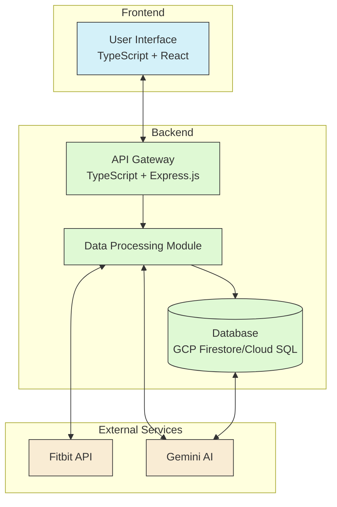
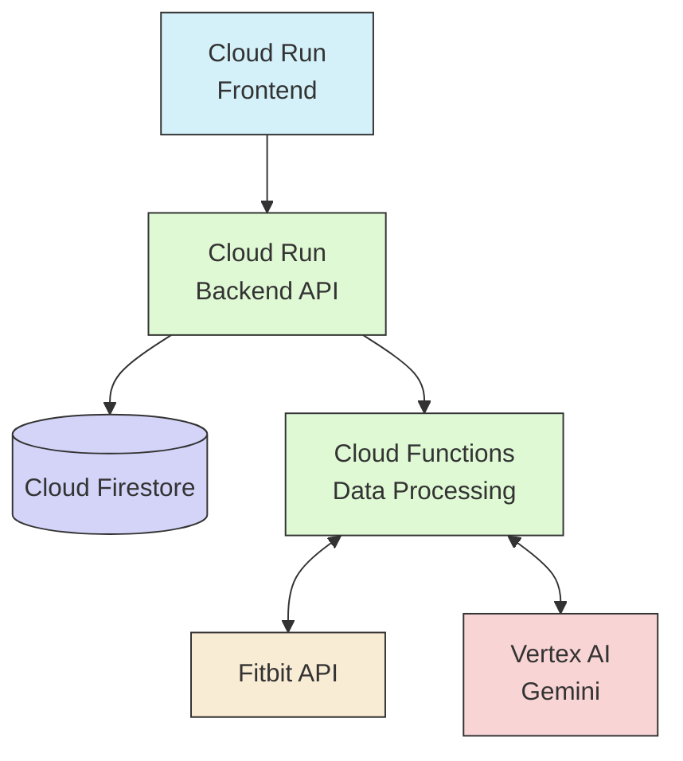

# myDr

Your partner in preventing disease by tracking and analyzing your life log.

## What is it?

myDr logs and analyzes your life, unveiling insights about your lifestyle. The main function is to reason through your life log.

## Main Features

- Analyze your life log from your life log tracker (currently, only Fitbit is supported).

## Requirements

- Fitbit life log tracking device
- Fitbit account

## How it Works

- **Data Retrieval**: Use the Fitbit API to obtain your life log data.
- **Analysis**: Utilize Gemini to analyze and reason through the obtained life log data.

## How to Use

1. Use your Fitbit device to record your daily activities.
2. Open the myDr app and log in with your Fitbit account.
3. The app will automatically retrieve data through the Fitbit API and start the analysis.
4. Review the analysis results to gain insights and tips for lifestyle improvements.

## System Architecture

### Data Flow

1. Users access the application through the frontend interface
2. The backend API gateway processes requests
3. The data processing module retrieves users' life logs from the Fitbit API
4. Collected data is stored in the database
5. Gemini AI analyzes the data and generates insights
6. Analysis results are stored in the database and displayed on the frontend

### Deployment Architecture on GCP

